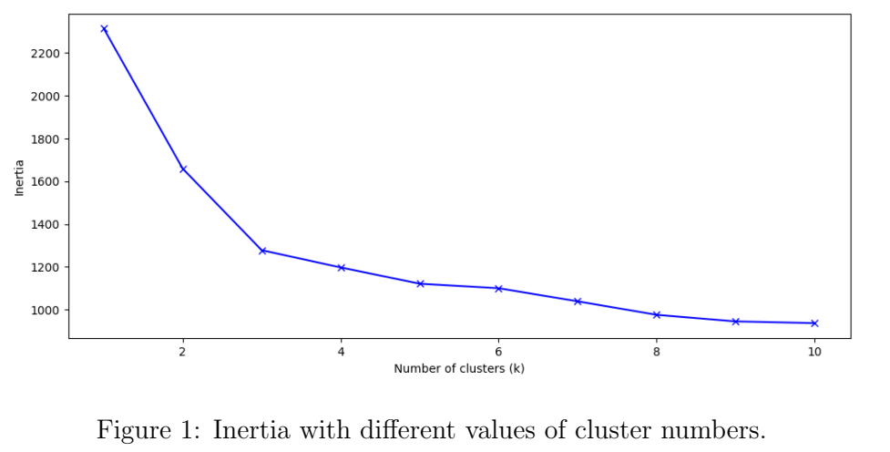
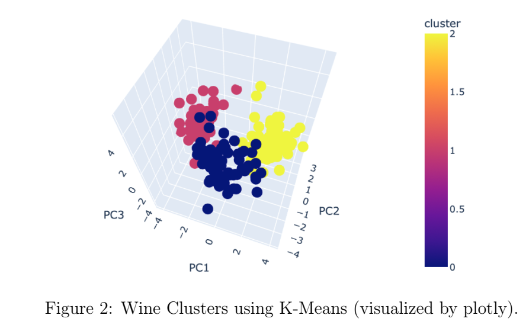
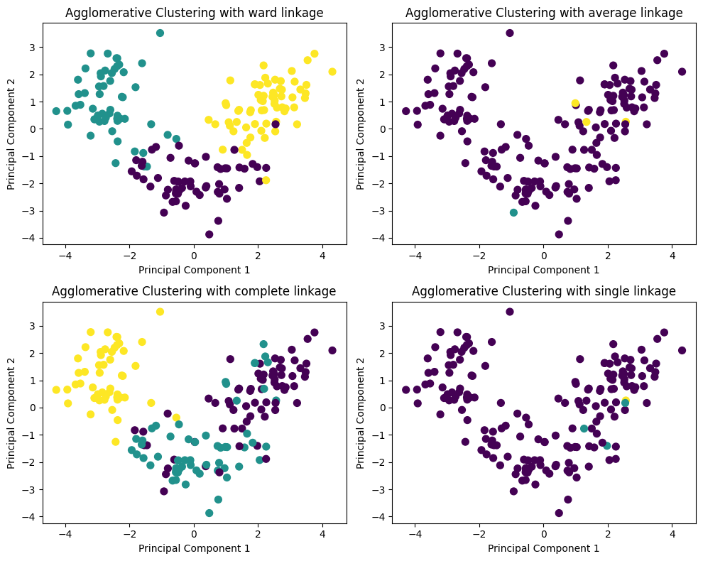
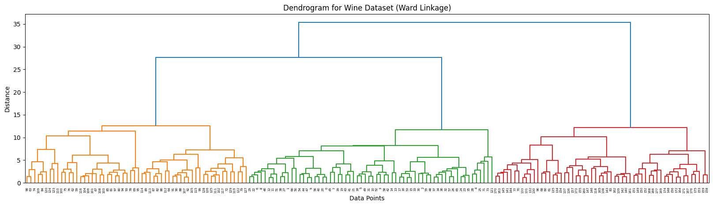
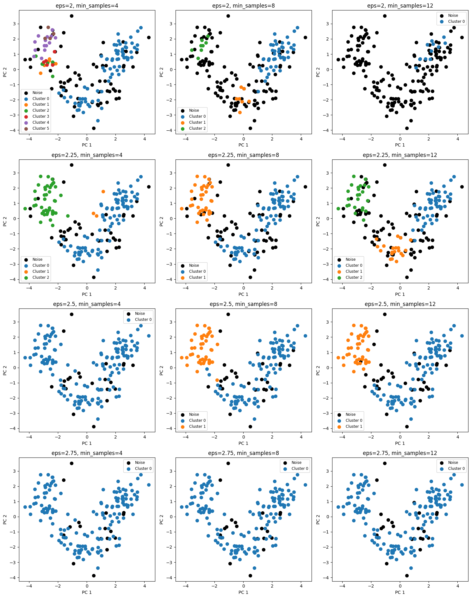

# LAB 03 - CLUSTERING
Clustering is an essential task in data mining, which aims to group data into clusters so that all similar data points are grouped together, while dissimilar ones belong to the different groups.

This lab focuses on implementing and analyzing the following clustering algorithms:
1. **Partitioning Approach: K-Means**
2. **Hierarchical Method: Agglomerative Clustering**
3. **Density-Based: DBSCAN**

By completing this lab, students will:
1. Understand the working principles of clustering algorithms. 
2. Implement clustering techniques using Python libraries.
3. Analyze the results to derive meaningful insights from clustering outcomes.

## **1. Dataset**
## **2. Requirements**
Implement the following clustering algorithms using **Python** libraries (e.g., `scikit-learn`, `scipy`).
### **2.1. Partitioning Approach: K-Means**
* Perform **K-Means** clustering for different values of $k (1 \leq k \leq 10)$.
* For each value of $k$, compute and display the inertia. Find the optimal number of clusters by applying the **Elbow Method** and explain your choice.

* Using the optimal $k$, visualize the resulting clusters on three dimensions using **PCA**.

### **2.2. Hierarchical Method: Agglomerative Clustering**
* Perform clustering using **Agglomerative Clustering** and experiment with different linkage (`ward`, `average`, `complete`, `single`). Visualize the resulting clusters for each linkage method and provide your insights based on the observed outcomes.

* Create a **dendrogram** to visualize the **clustering hierarchy** using any linkage method. Discuss the insights and information that can be derived from the dendrogram.

### **2.3. Density-Based: DBSCAN**
* Use the **DBSCAN** to detect clusters and noise in the data. Experiment with different values for the parameters `eps` (the radius of the neighborhood) and `min_samples` (the minimum number of points required to form a cluster). Visualize the resulting clusters and noise points.

* How does the change in `eps` and `min_samples` affect the density necessary to form a cluster?
## **3. Report (Jupyter Notebook)**
* The source code, result will be reported in a Jupyter Notebook with the following requirements:
* Student information (Student ID, full name, etc.).
* Self-evaluation of the assignment requirements.
* Detailed explanation of each step. Illustrative images, diagrams and equations are required.
* Each processing step must be fully commented, and results should be printed for observation.
* The report needs to be well-formatted.
* Before submitting, re-run the notebook (Kernel → Restart & Run All).
* References (if any).
## **4. Assessment**
|  No.  | Detailed Tasks                                | Completion Rate |
|:-----:| --------------------------------------------- |:---------------:|
| **1** | **Data Preprocessing**                        |   **$100\%$**   |
| **2** | **Machine Learning Models for Clustering**    |                 |
|  2.1  | Partitioning Approach: K-Means                |     $100\%$     |
|  2.2  | Hierarchical Method: Agglomerative Clustering |     $100\%$     |
|  2.3  | Density-Based: DBSCAN                         |     $100\%$     |